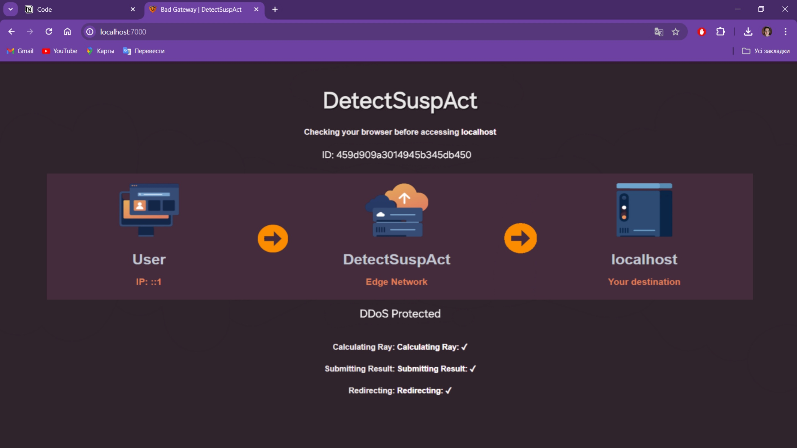

# DetectSuspAct

DetectSuspAct — це інноваційний проект з використанням машинного навчання, який залучає TensorFlow.js для нагляду та виявлення зловмисницької активності як у логах доступу до веб-сервера, так і в логах входу в систему. Ця динамічна система створена з метою забезпечення захисту вашого сервера, активно реагуючи на підозрілі зміни та допомагаючи у запобіганні можливих загроз безпеці.

Завдяки складній моделі Рекурентної Нейронної Мережі (RNN), DetectSuspAct спеціалізується на розумінні послідовних даних. Це дозволяє системі розуміти тимчасові залежності в журналах та точно виявляти патерни шкідливої активності. Цей підхід особливо ефективний для логів входу в систему, де послідовність спроб може вказувати на шкідливі наміри.

Завдяки впровадженню моделі машинного навчання, DetectSuspAct виходить за межі традиційних систем, що працюють на основі правил, і надає динамічний та адаптивний захист. Ця система призначена для навчання та постійного удосконалення з часом, щоб вдосконалити свою здатність розрізняти легітимну активність від шкідливої, тим самим надаючи поступово міцний захист веб-серверу.

Незалежно від того, чи потрібний захист від атак Distributed Denial of Service (DDoS), спроби злому паролів або інші форми шкідливої активності, DetectSuspAct пропонує передове рішення, підсилене машинним навчанням, щоб зміцнити безпеку  веб-сервера.

<p align="center">
    
</p>

## Як це працює?

# Middleware:

DetectSuspAct також включає функцію обмеження частоти для запобігання зловживання веб-сервером шляхом обмеження кількості запитів з одної IP-адреси протягом певного періоду часу. Обмеження частоти використовує Redis як сховище даних для відстеження кількості запитів, що надійшли від кожної IP-адреси.

Обмежувач частоти може бути налаштований за наступними параметрами:
- limit (максимальна кількість дозволених запитів протягом вказаного періоду часу);
- resetInterval (період часу в мілісекундах, після якого лічильник запитів для IP-адреси повинен бути скинутий);
- nonceLimit (максимальна кількість унікальних значень, дозволених протягом вказаного періоду часу);
- nonceWindow (період часу в мілісекундах, після якого лічильник унікальних значень для IP-адреси повинен бути скинутий);
- blockDuration (період часу в мілісекундах, на який запити з IP-адреси повинні бути заблоковані після перевищення ліміту).

## Змінні середовища

В додатку використовуються наступні змінні середовища:
- SECRET (sg809psargae9pr8gaertgheho9ar8g);
- DIFFICULTY (0);
- PORT (7000);
- TARGETURL (http://127.0.0.1:3000);
- WHITELISTED (127.0.0.1);
- Redis_Username (default);
- Redis_Password (qVFxATVuYmGMwJRengkJYm1Z0cz9V8bi);
- Redis_Host (redis-15979.c21.us-east-1-3.ec2.cloud.redislabs.com);
- Redis_Port (6379);
- Session_Time (30);
- Max_Requests (100000);
- Reset_Interval (1);
- BlockDuration (2).

1. Перевірте, чи встановлені у вас всі необхідні залежності:

```
node -v

npm -v

nginx -v

redis-server --version
```
2. Запустіть проект
```
npm start
```
